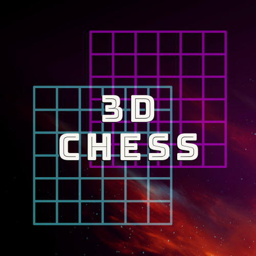

# 3DChess


## What is it?
3DChess is a version of the standard chess game which incorporates more than one board of play. Instead of the standard horizontal, verticle, and diagonal movements, 3DChess incorporates up and down movements between three stacked 8x8 chess boards, allowing for much more complex strategy.

* * *
## Build Requirements:
Linux (Debian-like/Ubuntu):
* libglfw3-dev
* libclgm-dev 

```bash
sudo apt-get install -y libglfw3-dev libcglm-dev
```  

To build:  
```bash
make
```

MacOS (Apple Silicon)
* Unsupported (OpenGL deprecation)
* _Note: Build will compile, but graphics will crash_

MacOS (x86-64)
* Untested

Windows (x86-64)
* Untested

Windows (ARM)
* Untested
* * *
## Python | Pytorch | Pygame

### Versions
All Python code was written with `Python 3.6.8` and above. Pytorch version `2.0.0` or higher is *required*. Pygame version ` 2.4.0 ` was used for preprocessing data. Older versions of the above were not tested or will bork if specified.

To check versions
```python
import torch
import sys
import pygame
# Python Version
print(sys.version)
# Pytorch Version
print(torch.__version__)
# Pygame Version
print(pygame.version.ver)
```


* * *
## Upcoming Features
* [X] Graphics Support
* [ ] Neural-netork-based opponent
* [ ] Testing on Windows (x86-64)
